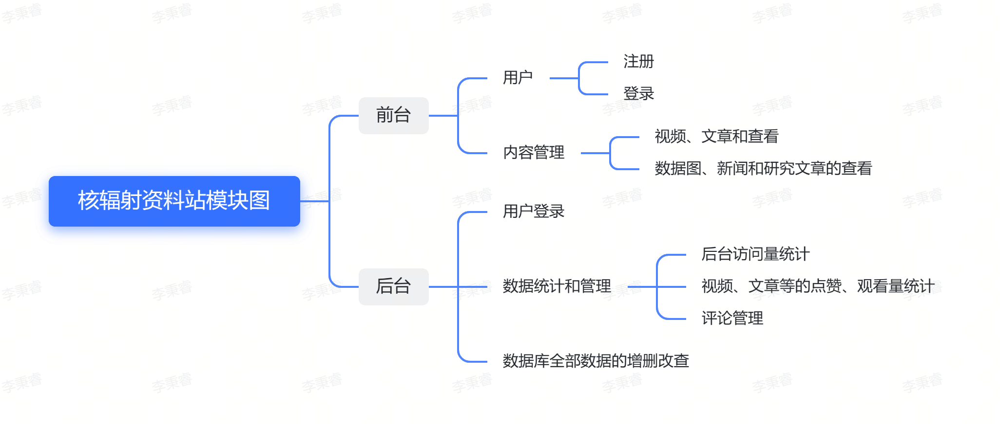

# 数据库设计文档
## 概述
本数据库用于存储视频、文章、评论、用户与管理员信息等。
数据库结构被设计为支持以下功能：
- 用户注册与登录
- 核辐射相关视频、新闻、研究、文章的发布与管理
- 核辐射数据的发布
- 评论功能
- 视频文章点击量统计
- 网页点击量统计
- 联系维护人员

## 数据库字典
### article 博客文章
  `id` int(11) 主键
  `title` varchar(255) 标题
  `description` text 描述
  `content` text 内容
  `date` date 日期
  `image` varchar(255) 图片
  `viewed` int(11) 点击次数
  `created_by` int(11) 创建者
  `status` int(11) 状态
  `category_id` int(11) 归属目录分类

### category 文章分类
  `id` int(11) 主键
  `title` varchar(255) 目录名称

### comment 评论
  `id` int(11) 主键
  `text` varchar(255) 评论内容
  `user_id` int(11) 评论者id
  `article_id` int(11) 文章id
  `status` int(11) 状态，是否被允许看见
  `date` date 评论日期
  `video_id` varchar(16) 视频id

### contact_form 联系信息
  `id` int(11) 主键
  `firstname` varchar(50) 名
  `lastname` varchar(50) 姓
  `sex` tinyint(1) 性别
  `wechatid` varchar(50) 微信号
  `phone` varchar(50) 电话号
  `message` varchar(255) 信息

### news 新闻
  `id` int(11) 主键
  `pubDate` varchar(225) 日期
  `title` varchar(225) 标题
  `summary` varchar(2000) 文章内容
  `infoSource` varchar(225) 消息来源
  `sourceUrl` varchar(225) 原文链接
  `image` varchar(512) 配图链接

### research 研究
  `id` int(11) 主键
  `title` varchar(255) 标题
  `summary` varchar(2000) 总结
  `url` varchar(255) 链接
  `date` varchar(255) 日期
  `image` varchar(255) 图片链接

### counter_save 数据记录计数器
  `save_name` varchar(10) 计数器名 主键
  `save_value` int(10) 计数器值
目前存储了总访问量、当日访问量、最大访问量日期等数据。

### avg_new 辐射量数据
  `name` varchar(255) 地点名 主键
  `avg_value` decimal(14, 4) 辐射量值

### nuclear_data 全国空气吸收剂量率数据表
  `nuclear_data_id` 数据表项id 主键
  `name` varchar(255) 省份或核电站名称
  `location` varchar(255) 省级监测站或核电站下属监测站名称
  `value` varchar(255) 吸收剂量率值
  `date` date 监测日期
  `parent_id` varchar(15) 所属省份或核电站的id（即下方的id项）
  `type` varchar(5) 表项类型
  `id` varchar(20) 所属省份或核电站的id
  `itemkey` varchar(20) 数据所属监测站id
  `itemcode` varchar(30) 检测数据对应编码，由网站给定
  `itemname` varchar(30) 检测数据名称
  `time` varchar(30) 数据上传时间

### user 用户
  `id` int(11) 用户id 主键
  `username` varchar(32) 用户名
  `auth_key` varchar(32) 用于cookie验证用户身份，yii2生成
  `password_hash` varchar(256) 密码的哈希值
  `email` varchar(256) 邮箱
  `status` int(11) 账号状态
  `created_at` int(11) 注册时间
  `updated_at` int(11) 更新时间
  `verification_token` varchar(256) 验证需要的token

### video 视频

  `video_id` varchar(16) 视频id 主键
  `title` varchar(255) 视频标题
  `description` text 视频描述
  `tags` varchar(512) 标签
  `status` int(11) 状态
  `has_thumbnail` tinyint(1) 点赞
  `video_name` varchar(255) 视频文件名
  `created_at` int(11) 创建时间
  `updated_at` int(11) 更新时间
  `created_by` int(11) 创建者

### video_like 存储点赞情况
  `id` int(11) 主键
  `video_id` varchar(16) 视频id
  `user_id` int(11) 用户id
  `created_at` int(11) 点赞时间

### video_view 存储视频观看情况
  `id` int(11) 主键
  `video_id` varchar(16) 视频id
  `user_id` int(11) 用户id
  `created_at` int(11) 观看时间

## 模块图
